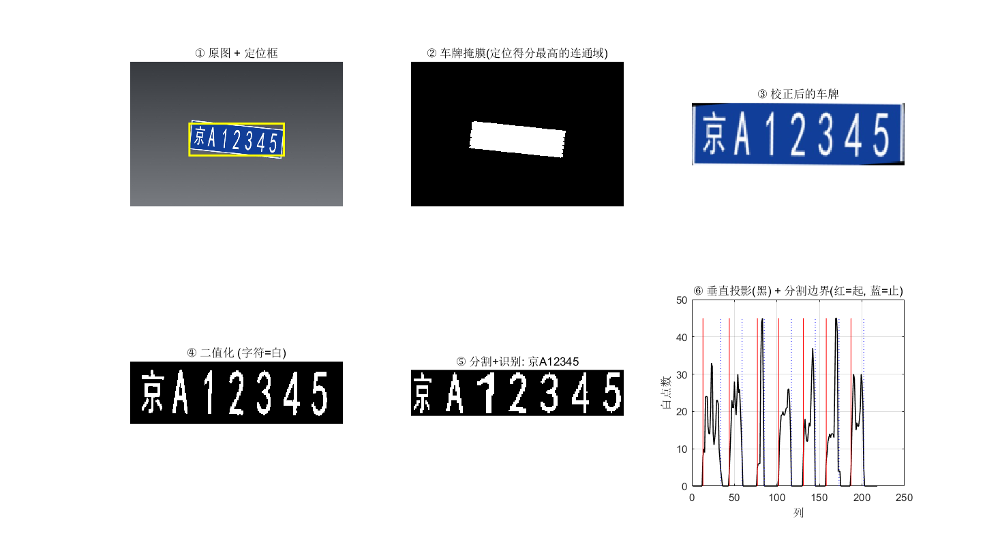

# 车牌识别 · MATLAB 工程实例 + 免安装网页版

中国大陆车牌（蓝底白字 / 新能源绿牌 / 黄底黑字）照片识别的完整实现。
一条流水线 —— **车牌定位 → 倾斜校正 → 字符分割 → 字符识别** —— 三种交付形态，
算法与参数一一对应。

| 目录 | 形态 | 需要装什么 | 适合场景 |
|---|---|---|---|
| [`matlab/`](matlab/) | MATLAB 工程本体 | MATLAB R2024b + Image Processing Toolbox | 课程设计 / 毕设、讲清算法、调参 |
| [`site/`](site/) | **单文件网页版**（一个 `index.html`） | 什么都不用装，浏览器打开就行 | 随手试用、发给别人看 |
| [`server/`](server/) | Python + MATLAB 后台版 | Python 3 + MATLAB | 局域网 / 公网给多台设备用 |

网页版是把 `matlab/` 的流水线用 JavaScript 重写，字符模板直接从 `matlab/templates.mat`
导出（31 汉字 + 24 字母 + 10 数字），所以两版识别结果基本一致。



## 在线试用

不想装环境就点这个（GitHub Pages 纯静态页，**识别在你自己浏览器里完成，照片不会上传**）：

**https://shyang-147.github.io/license-plate-recognition/**

## 实测数据

三个测试集（全部是合成图，只用来做回归自查；每个数字都能按下面的命令复现）：

| 集合 | 内容 | 怎么来 |
|---|---|---|
| `matlab/bench/` | 20 张：随机省份/字母/数字、倾斜 ±9°、尺寸 0.6~1.15 倍、随机模糊噪声 | 随仓库提供（`tools/make_bench.py` 生成） |
| `matlab/images/` | 3 张演示图 | 随仓库提供 |
| `matlab/hard/` | 24 张难集：**新能源 8 位牌** / **斜拍（梯形畸变）** / **小尺寸（车牌仅 120~170 px 宽）** / **夜间** 各 6 张 | 本地跑 `python tools/make_hard.py` 生成（图不进版本库） |

| 指标 | MATLAB 版 | 网页版（JS） |
|---|---|---|
| 整牌正确率（bench 20 张） | **95.0% (19/20)** | 90.0% (18/20) |
| 字符正确率（bench 20 张） | **99.3% (139/140)** | 98.6% (138/140) |
| 首位汉字正确率（bench 20 张） | 100% (20/20) | — |
| 字符数分割正确率（bench 20 张） | 100% (20/20) | 100% (20/20) |
| 演示图 `images/` 3 张 | 3/3 全对 | 3/3 全对 |
| 整牌正确率（hard 24 张） | 66.7% (16/24) | **70.8% (17/24)** |
| 　└ 新能源 8 位 / 斜拍 / 小尺寸 / 夜间 | 6/6 · 1/6 · 4/6 · 5/6 | 6/6 · 0/6 · 5/6 · 6/6 |
| 整牌正确率（真实照片 `测试数据/real2/` 3 张） | 0.0% (0/3) | 0.0% (0/3) |
| 平均单张耗时 | 约 150 ms | 约 150~350 ms |

复现：

```matlab
cd matlab
bench_eval                          % bench 20 张
bench_eval(fullfile(pwd,'hard'))    % 先跑过 python ../tools/make_hard.py
```

```bash
node site/tools/test_browser.mjs     % 网页版：无头浏览器真实上传 5 张图，全 PASS
```

怎么读这张表：

- **bench/hard 上剩下的瓶颈只有斜拍和形近字符**：定位、几何校正、去外框、字符分割都已稳定
  （bench 字符数 100%、首位汉字 100%）。错的集中在斜拍透视图（hard 斜拍 1/6）和
  `9↔X`、`6↔8` 这类形近字符上。要再往上走只有换 CNN 识别（见第 6 节）。
- **两版引擎的数字不一样是正常的**：MATLAB 用 `adapthisteq + Otsu`，网页版用
  `illumNormalize + Otsu`，二值化后笔画的胖瘦不同，连"特征二值化阈值"这种调参常数
  两版也不同（MATLAB `0.5`、网页版 `0.35`，各自的实测依据都写在代码注释里）。
  改任一侧参数前请把 `verify_lpr` + `run_all` + `run_js.mjs` 都重跑一遍。
- **合成集上的数字不能外推**：同一套参数用在**远距离**真实路拍照片上（`测试数据/real2/`
  3 张）整牌仍是 0/3。不过对**近景、车牌占满画面**的手机实拍，修好外框白线后已经能
  整牌全对（第三轮实测，见下文）。

### 本轮改进（三项）

| 改动 | 文件 | 实测效果 |
|---|---|---|
| **① 8 位新能源车牌**：字符数不再按固定比例估，改成用切分结果自校准 | `matlab/segmentChars.m`、`site/src/lpr_engine.js` | 难集新能源 **0/6 → 6/6**（两版都是）；7 位普通牌不受影响 |
| **② 车牌制式后处理**：新增 `plateFormat.m` 按位限定候选字符集，细长墨迹偏向 `1` | `matlab/plateFormat.m`（新增）、`recognizeChars.m`、`lpr_engine.js` | 难集整牌 25.0% → 58.3%，字符 42.5% → 75.3%；bench 字符 87.9% → 92.1%（MATLAB）；JS 难集整牌 20.8% → 50.0% |
| **③ 透视校正**：车牌四角构成梯形时用单应变换拉正（旋转+透视一次解决） | `matlab/correctPlate.m`、`lpr_engine.js` | 斜拍样本字符级明显变好（如 pe01 `*KZP816N` → `*J39818`），但 6 张仍没有一张整牌全对 |

① 原来是 `nEst = min(8, max(6, round(span/(0.125*W))))`：车牌裁紧以后，7 位普通牌和
8 位新能源牌的 `span/W` 都在 0.87 左右，这个式子**永远算出 7**，8 位牌会被强行合并掉
一个字，整牌必错。现在改成在 6/7/8 三个候选里挑"相邻字符中心间距最均匀"的那个。

③ 只在车牌**四角明显是梯形**（上下边不等长 > 8% 或四角偏离直角 > 10°）**且车牌足够大**
（高 ≥ 32 px）时才启用，其余情况仍走原来的旋转校正：本来就正的图多插值一次只会更糊。
这道闸门是实测调出来的 —— 不加的时候，小尺寸样本（掩膜只有几十像素宽，台阶状的边界
让极值点抖一两个像素就能凑出"梯形"）会被误触发，难集整牌反而从 58.3% 掉到 50.0%。

### 补充改进：残留车牌边框（2026-09 第二轮）

| 改动 | 文件 | 实测效果 |
|---|---|---|
| **④ 去外框改用"外圈窄带内最长连续笔画"判据** | `matlab/segmentChars.m`、`site/src/lpr_engine.js` | 网页版 bench 字符 90.0% → **92.1%**、难集字符 90.2% → **90.8%**、整牌不变；真实照片里正确字符落进候选前二的从 1/15 涨到 4/14，但整牌仍是 0/3 |
| **⑤ 定字数先试 7 / 8**（单排车牌只有这两种制式），拟合不上再退回 6~8 | 同上 | ④ 单独上线时 real01 会被切成 6 段，⑤ 把它恢复到正确的 **8 段**；bench / 难集逐图结果完全不变 |
| **⑥ 修正真实照片集的标注** | 归档目录 `测试数据/real2/labels.csv` | 图上实际是 `京A3454警`（白底警用车牌），原标注 `京A0000警` 是错的 |

④ 原来的判据是"连续笔画超过 `0.60*W` 的水平线 / `0.85*H` 的竖线"，对合成图够用，对真实照片会漏：
真实牌照的边框被 JPEG 与模糊**打断成几段**（实测 real01 的下边框断成 51 px 和 142 px 两段，
都短于 `0.60*W` 的核长），于是整条边框残留下来，把每个字符的墨迹包围盒从 42 行撑到 58 行，
归一化时字符被纵向压扁，模板匹配得分从 0.7 掉到 0.3。现在把水平判据放宽到 `0.35*W`
（字符最长的横画也只有约 `0.13*W`，余量充足），并限制在车牌外圈窄带内生效 ——
不限范围的话会误删"相邻字符底部对齐"的行（合成集里这类行的墨迹率最高到 `0.57*W`，
和真实的边框线分不开）。

**这一项修好了"字符被压扁"，但没有修好真实照片的识别**，原因见"已知限制"。

### 补充改进：车牌外框白线（2026-09 第三轮）

第二轮 ④ 只是缓解，**并没有真正解决边框残留**。这一轮定位到真正的原因并修掉了它：

| 改动 | 文件 | 实测效果 |
|---|---|---|
| **⑦ 去外框改成"按连通域删除贴边细长块"，并补上"线条状"判据** | `matlab/segmentChars.m`、`site/src/lpr_engine.js` | MATLAB bench 整牌 25.0% → **95.0%**、字符 75.0% → **99.3%**、分割 60.0% → **100%**；hard 整牌 41.7% → **66.7%**；`verify_lpr` 由 25 通过/4 失败回到 **29 通过/0 失败** |
| **⑧ 极窄墨迹段（宽高比 < 0.22）直接判为 `1`** | `matlab/recognizeChars.m`、`lpr_engine.js` | bench 整牌 85.0% → **95.0%**（修掉 `1` 被认成 `4` 的两张）；手机实拍近景里的 `1` 也由此读对 |
| **⑨ 撤回"降低特征二值化阈值"** | 同上 | 见下方"为什么撤回" |

**⑦ 真正的原因**：车牌上有一圈**白色的外框线**（不是深色边框），二值化之后它和字符一样是"白"。
它是**闭合的矩形环**，于是：

- `面积 / 最长边` ≈ 6.8 —— 长边、短边的面积都算进了分子，却只除以其中一条长边，
  比真实线宽大了一倍左右，第一版"细长 => 删掉"的判据直接漏掉；
- 它又贴着车牌外沿，于是每个字符的列区间里都混进了这条白线，墨迹包围盒从 42 行被撑到 62 行，
  `normalizeChar` 把字符纵向压扁、底部还多一条横线，匹配分整体垮掉。

而 `面积 / 周长` 对任何细线都约等于**真实线宽**（实测外框 1.26 px、汉字笔画 1.67~2.2 px），
所以判据改成"贴边 + 够长 + （`面积/最长边` ≤ 4.5 **或** `面积/周长` ≤ 1.5）"，
同时覆盖"被 JPEG 打断的下边框"（细长条）和"闭合的外框白线"（矩形环）两种形态。
副作用是 bench 分割正确率从 95% 回到 **100%**：原来左下角残留的 1 px 宽、23 px 高的边框残端
会被当成第 8 个字符。

**⑧ 极窄段判 `1`**：`normalizeChar` 的 `fill` 模式会把又窄又高的 `1` 横向拉成实心方块
（实测某段墨迹宽高比 0.132，被拉宽后对模板 `1` 只有 0.31 分，而 `8` 拿到 0.51）。
逐图实测**所有数据集里第 2 位起、宽高比 < 0.22 的段 100% 都是 `1`**（车牌上唯一的细长字符，
`I` 已被排除），所以这个区间直接判 `1`；`0.22~0.30` 之间还有新能源牌被纵向压缩后的
`D/Q/5/9/F/G`，只保留原来的 +0.06 小加分、不强制。

**⑨ 为什么撤回"降阈值"**：修好外框之后重新扫了一遍特征二值化阈值 ——

| 特征二值化阈值 | bench 整牌/字符 | hard 整牌/字符 | 真实集字符 |
|---|---|---|---|
| **0.50（采用）** | 0.850 / 0.979 | **0.667 / 0.833** | **0.045** |
| 0.45 | 0.850 / 0.979 | 0.625 / 0.828 | 0.000 |
| 0.40 | 0.850 / 0.979 | 0.583 / 0.822 | 0.000 |
| 0.35 | 0.850 / 0.979 | 0.500 / 0.805 | 0.000 |

降阈值会把所有笔画一起喂胖，`3` 变 `8`、`0` 变 `9`，hard 单调变差，所以 MATLAB 侧维持 `0.5`。
网页版相反（`0.35` 更好：hard 70.8% vs 62.5%），因为它的光照归一化与降采样更"细瘦"；
两边的取值和实测依据都写在各自代码的注释里，**不要只调一边**。

### 手机实拍近景：`苏A1085K` 从 0/7 到 7/7

用户提供的近景实拍（1024×768，车牌占满画面，带白色外框线和中间分隔点 `·`）：

| 阶段 | 结果 |
|---|---|
| 修复前 | `*A4844K`（首位 `苏` 置信度 0.31 被置 `*`，`1→4`、`0→8`、`8→4`、`5→4`） |
| 修 ⑦ 之后 | `苏A8085K`（只剩 `1→8`） |
| 修 ⑦+⑧ 之后 | **`苏A1085K` 整牌全对**（平均置信度 0.63，MATLAB 与网页版结果一致） |

这张图不在仓库里，所以上表没有把它算进准确率；放进来是因为它是这次问题的原始现场。

## 算法流程

| 步骤 | 文件（MATLAB） | 做法 |
|---|---|---|
| ① 车牌定位 | `locatePlate.m` | 蓝/绿/黄底色掩膜 + Sobel 边缘掩膜 + 形态学闭运算连成候选块；按长宽比、面积、底色占比、边缘密度、矩形度打分取最优 |
| ② 真车牌闸门 | `locatePlate.m` | 矩形度 < 0.50 或框内底色占比 < 0.30 直接判为假车牌，返回"未检测到"（防蓝色广告牌误检） |
| ③ 几何校正 | `correctPlate.m` | 取车牌掩膜的四个极值点当四角：四角明显是梯形时用单应变换拉正（**透视校正**），否则沿用"上下边界拟合倾角 → 反向旋转"；统一高度归一到 64 px |
| ④ 字符分割 | `segmentChars.m` | CLAHE 增强 → Otsu 二值化 → 清除车牌外框/边框残留 → 垂直投影切字符段 → **按"间距均匀度"自校准字符数（6~8，兼容新能源 8 位牌）** → 归一化，同时输出每段墨迹宽高比 |
| ⑤ 字符识别 | `recognizeChars.m` | 单字符归一化到 32×16 → 降采样 24×12 特征 → 与模板库比对 `0.65×IoU + 0.35×相关系数`；**按 `plateFormat.m` 逐位限定候选字符集**（第 1 位汉字 / 第 2 位字母 / 新能源第 3 位字母 / 其余字母数字），极细长的墨迹偏向数字 `1`，首位置信度 < 0.45 输出 `*` 占位 |

## 目录结构

```
license-plate-recognition/
├─ matlab/                  MATLAB 工程本体（课程设计交这一套）
│  ├─ lpr_main.m            主入口：读图 → 定位 → 校正 → 分割 → 识别
│  ├─ locatePlate.m         车牌定位
│  ├─ cropPlate.m           按定位框裁剪（同步裁剪掩膜）
│  ├─ correctPlate.m        几何校正：透视拉正 / 倾斜旋转 + 高度归一化
│  ├─ segmentChars.m        二值化 + 字符分割（字符数自校准）
│  ├─ normalizeChar.m       单字符归一化到 32×16
│  ├─ charFeature.m         降采样成 24×12 特征
│  ├─ recognizeChars.m      模板匹配识别（按位限定候选集）
│  ├─ plateFormat.m         车牌制式：7 位普通 / 8 位新能源，逐位允许的字符集
│  ├─ recognizeCharsCNN.m   CNN 识别（可选，配合 train_char_cnn.m 训练）
│  ├─ templates.mat         字符模板库（31 汉字 + 24 字母 + 10 数字）
│  ├─ buildTemplates.m      重新生成模板库
│  ├─ verify_lpr.m          一键自检（29 项）
│  ├─ debug_one.m           逐级可视化，定位问题出在哪一步
│  ├─ bench_eval.m          带标注图集的批量评测
│  ├─ images/               3 张演示图 + expected.csv
│  └─ bench/                20 张基准图 + labels.csv
├─ site/                    单文件网页版
│  ├─ index.html            ← 双击就能用（自包含，0 个外部请求）
│  ├─ start_lan.bat         局域网共享（同一 WiFi 下手机可打开）
│  ├─ src/                  源文件，改完跑 python src/build_site.py 重新生成 index.html
│  └─ tools/test_browser.mjs 无头浏览器端到端测试
├─ server/                  Python + MATLAB 后台版
│  ├─ server.py             只用 Python 标准库，不需要 pip install
│  ├─ worker_lpr.m          MATLAB 常驻 worker（轮询任务、调 lpr_main）
│  ├─ static/index.html     网页前端
│  ├─ tools/                打包脚本 + API/浏览器测试脚本
│  └─ portable/             单文件打包版（支持公网隧道 + 访问口令）
├─ tools/                   测试图生成脚本（make_demo.py / make_bench.py / make_hard.py）
├─ docs/                    文档配图
└─ LICENSE                  MIT
```

## 快速上手

### ① 网页版（最快）

双击 `site/index.html`。点"选择照片"或直接 `Ctrl+V` 粘贴截图，几秒内出结果。

要发给别的设备：把 `index.html` 传过去用浏览器打开即可；同一 WiFi 下想直接用手机打开，
双击 `site/start_lan.bat`，它会打印一个形如 `http://192.168.x.x:8080/` 的地址。

### ② MATLAB 版

```matlab
cd matlab
lpr_main('images/demo_plate.jpg')   % 认一张图（会画出定位框、车牌、分割字符、结果）
verify_lpr                          % 一键自检 29 项
debug_one('images/demo_plate.jpg')  % 逐级调试图，看问题卡在哪一步
bench_eval                          % 跑 20 张基准集，输出准确率明细
```

### ③ 服务版

```bat
cd server
start_lan.bat        :: 局域网；首次运行会拉起 MATLAB worker（10~20 秒）
```

手机/其他电脑连同一个 WiFi，浏览器打开窗口里打印的局域网地址即可。
想在外网用，`server/portable/start_public.bat` 会开一条临时公网隧道并生成访问口令。

## 怎么验证程序是对的

| 想验证什么 | 怎么跑 | 期望 |
|---|---|---|
| MATLAB 环境、文件、各模块是否正常 | `verify_lpr` | 29 项全 PASS |
| 每张图的识别明细 | `bench_run` / `bench_eval` | 打印逐张结果 + 准确率汇总 |
| 到底哪一步出错 | `debug_one('图片路径')` | 6 张子图：原图+定位框 / 车牌掩膜 / 校正后车牌 / 二值化 / 分割字符 / 垂直投影 |
| 换算子/换参数有没有变好 | 改完再跑 `bench_eval` | 与上表对比 |
| 网页版是否正常 | `node site/tools/test_browser.mjs` | 无头浏览器真实上传 5 张图，全 PASS、页面 0 报错 |
| 服务版 API 是否正常 | `node server/tools/test_api.mjs`（先启动服务） | 逐项打印 HTTP 状态与时延 |

> 换自己的照片测试：放进 `matlab/bench/`，写一份 `labels.csv`（列为 `file,text`），
> 再跑 `bench_eval` 就能得到你自己的准确率。

## 已知限制

- 只认**中国大陆**车牌，依赖蓝/绿/黄底色。**白底车牌（警用 `京A3454警`、军用、使领馆）
  完全不支持**：`locatePlate.m` 的颜色掩膜里没有白色通道，`plateFormat.m` 也没有 `警` 这个字。
- 字符识别是模板匹配，形状相近字符（`1/4`、`9/X`、`3/V`）易混；要更准请走
  `train_char_cnn.m` 训练 CNN，用 `recognizeCharsCNN.m` 替换。
- **真实照片要分两类看**：
  - *近景实拍*（车牌占满画面）：修好外框白线之后已经能整牌全对（`苏A1085K` 7/7）。
  - *远距离 / 小目标路拍*（`测试数据/real2/` 3 张）：整牌仍是 **0/3**。其中 1 张定位就失败
    （白底警用车牌，颜色掩膜里没有白色通道），另 2 张照片里车牌只有 90~150 px 宽，
    拉正后的插值模糊已经超过模板匹配能容忍的范围。
  - 远距离场景的根因仍是**模板字体和真实牌照字体（GA 36 专用字体，笔画更窄）不是同一套字形**：
    实测 real01 切出的 `2` 和模板 `2` 肉眼看一样，IoU 只有 0.40。为了排除"只是度量不合适"，
    试过 6 种匹配度量（容差 IoU、对称倒角距离、IoU-only…）、模板加粗/变细变体、
    以及多字体模板（微软雅黑粗/等线粗/Arial Black…），**没有一种能改善**
    （详细实测见归档目录的 `评审与改进/`）。
    这一步只能换数据——用 CCPD / CRPR 这类**真实**车牌切出字符，
    走 `train_char_cnn.m` + `recognizeCharsCNN.m`（工程里已有骨架），
    或者退一步用真实切图替换 `buildTemplates.m` 的字体模板。
- 字符数是**自校准**的（7/8 位自适应）：bench 上分割正确率 100%、hard 上 91.7%；
  hard 里剩下那 2 张都是斜拍样本，透视插值把笔画糊掉之后确实分不开。
- **斜拍仍是弱项**：透视校正只在车牌被拍成明显梯形时才启用（否则退回旋转校正）。
  几何拉正能让斜拍样本的字符级明显变好，但拉正时的插值模糊又会拖累模板匹配，
  难集里 6 张斜拍图**没有一张整牌全对**（0/6）。
- 照片里车牌宽度至少 100 px；太远、太糊、过曝、夜拍、反光都会显著掉准确率。
- 照片里不要出现其它蓝底/绿底矩形物体（蓝色广告牌、蓝色车身），否则第一步可能定位错。
- 基准集与难集都是**合成图**（`tools/make_bench.py` / `make_hard.py` 生成），字体与模板同源，
  所以两张表上的数字**不代表**真实路拍准确率 —— 这是"自己考自己"。要看真实表现，
  请用归档目录里 `测试数据/real2/` 那种手机实拍图评测。

## 许可

[MIT](LICENSE)
