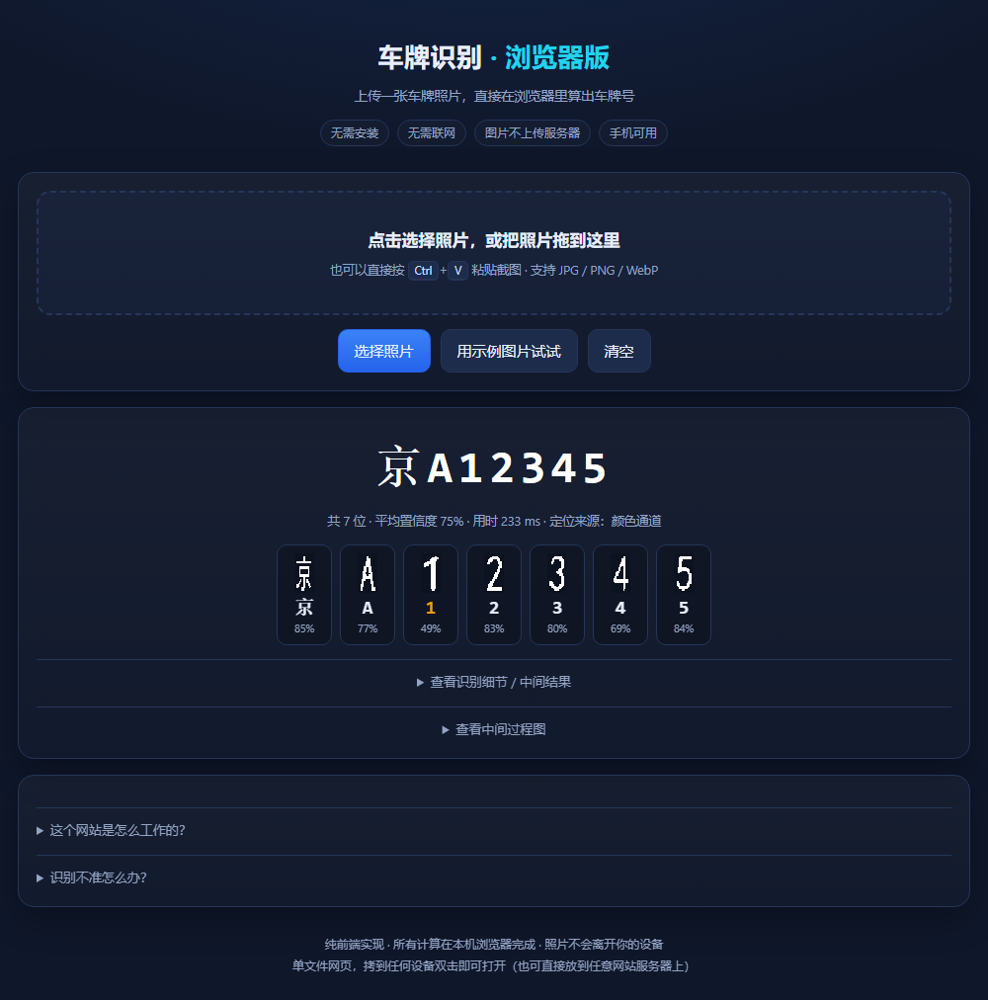

# 车牌识别：MATLAB 工程 + 免安装网页版

中国大陆车牌的照片识别，支持蓝底白字、新能源绿牌、黄底黑字、白底警用四种制式。
流水线是车牌定位 → 倾斜校正 → 字符分割 → 字符识别，同一套算法有三种交付形态，参数一一对应。



在线试用（GitHub Pages 纯静态页，识别在浏览器本地完成，照片不会上传）：
**https://shyang-147.github.io/license-plate-recognition/**

## 三种形态

| 目录 | 形态 | 需要装什么 | 适合场景 |
|---|---|---|---|
| [`matlab/`](matlab/) | MATLAB 工程本体（识别内核） | MATLAB R2024b + Image Processing Toolbox | 课程设计 / 毕设，讲清算法、调参 |
| [`site/`](site/) | 单文件网页版（一个 `index.html`） | 什么都不用装 | 随手试用、发给别人看 |
| [`server/`](server/) | Python + MATLAB 服务版 | Python 3 + MATLAB | 局域网 / 公网给多台设备用 |

网页版是把 `matlab/` 的流水线用 JavaScript 重写，字符模板从 `matlab/templates.mat` 导出
（31 个汉字 + 24 个字母 + 10 个数字 + 5 个特殊字 `警挂学领使`），两版识别结果基本一致。

## 快速上手

**① 网页版**：双击 `site/index.html`，点「选择照片」或直接 `Ctrl+V` 粘贴截图，几秒出结果。
同一 WiFi 下想用手机打开，双击 `site/start_lan.bat`，它会打印形如 `http://192.168.x.x:8080/` 的地址。

**② MATLAB 版**：

```matlab
cd matlab
lpr_main('images/demo_plate.jpg')   % 认一张图，会画出定位框、车牌、分割字符、结果
verify_lpr                          % 一键自检 30 项
debug_one('images/demo_plate.jpg')  % 逐级调试图，看问题卡在哪一步
bench_eval                          % 跑 20 张基准集，输出逐张明细和准确率
```

**③ 服务版**：`cd server` 后运行 `start_lan.bat`（首次运行会拉起 MATLAB worker，约 10~20 秒），
手机和其他电脑连同一个 WiFi，浏览器打开窗口里打印的局域网地址即可。
要在外网用，`server/portable/start_public.bat` 会开一条临时公网隧道并生成访问口令。

## 算法流程


| 步骤 | 文件（MATLAB） | 做法 |
|---|---|---|
| ① 车牌定位 | `locatePlate.m` | 蓝 / 绿 / 黄底色掩膜加 Sobel 边缘掩膜，形态学闭运算连成候选块，再按长宽比、面积、底色占比、边缘密度、矩形度打分取最优。颜色和边缘两路都没找到真车牌时，走一路白底车牌兜底通道（警用） |
| ② 真车牌闸门 | `locatePlate.m` | 矩形度 < 0.50、框内底色占比 < 0.30 或框内垂直边缘密度 < 0.02（框里必须切得出成排的字）判为假车牌，返回「未检测到」，用来挡蓝色广告牌和纯色车身。白底通道另有一组阈值：白底占比 ≥ 0.35、边缘密度 ≥ 0.02、矩形度 ≥ 0.40 |
| ③ 几何校正 | `correctPlate.m` | 取车牌掩膜的四个极值点当四角，四角明显是梯形时用单应变换拉正，否则按上下边界拟合倾角反向旋转；高度统一归一到 64 px |
| ④ 字符分割 | `segmentChars.m` | CLAHE 增强 → Otsu 二值化 → 清除车牌外框残留 → 垂直投影切字符段 → 按间距均匀度自校准字符数（6~8，兼容新能源 8 位牌） |
| ⑤ 字符识别 | `recognizeChars.m` | 单字符归一化到 32×16，降采样成 24×12 特征，与模板库比对 `0.65×IoU + 0.35×相关系数`；由 `plateFormat.m` 逐位限定候选字符集，首位置信度 < 0.45 时输出 `*` 占位 |

## 实测结果

| 测试集 | 内容 | 怎么来 |
|---|---|---|
| `matlab/bench/` | 20 张：随机省份 / 字母 / 数字，倾斜 ±9°，尺寸 0.6~1.15 倍，带随机模糊噪声 | 随仓库提供（`tools/make_bench.py` 生成） |
| `matlab/images/` | 3 张演示图 | 随仓库提供 |
| `matlab/hard/` | 24 张难集：新能源 8 位 / 斜拍（梯形畸变）/ 小尺寸（车牌宽 120~170 px）/ 夜间，各 6 张 | 本地跑 `python tools/make_hard.py` |
| 合成退化集 | 60 张：车牌宽 220→38 px 共十档，每档同一批车牌，先按 440×140 渲染再降采样，外加定像素高斯模糊和 JPEG | 本地跑 `python tools/make_degrade.py` |
| 真实照片降采样集 | 18 张：3 张真实照片 × 6 档 | 本地跑 `python tools/make_degrade_real.py` |
| CCPD 真实照片集 | 360 张：CCPD2019 抽样的 9 个 subset 各 35~36 张，外加 40 张真实无车牌图做负样本 | 本地跑 `python tools/fetch_ccpd_sample.py` |

> 除 `bench/` 和 `images/` 外，测试图片都不进版本库，需要本地生成或下载。

| 指标 | MATLAB 版 | 网页版 |
|---|---|---|
| bench 整牌正确率（20 张） | 95.0% (19/20) | 95.0% (19/20) |
| bench 字符正确率 | 99.3% (139/140) | 99.3% (139/140) |
| bench 字符数分割正确率 | 100% | 100% |
| hard 整牌正确率（24 张） | 75.0% (18/24) | 79.2% (19/24) |
| 　└ 新能源 / 斜拍 / 小尺寸 / 夜间 | 6/6 · 2/6 · 5/6 · 5/6 | 5/6 · 2/6 · 6/6 · 6/6 |
| 真实照片整牌正确率（3 张） | 0/3 | 0/3 |
| CCPD 整牌 / 字符 / 定位 IoU≥0.5（320 张） | 0/320 · 6.4% · 35.3% | 未接入 |
| CCPD 误检（40 张真实无车牌照片） | 15/40 | 未接入 |
| 平均单张耗时 | 约 150 ms | 约 150~350 ms |

分辨率退化曲线（合成退化集 60 张，按档归因）：

| 车牌宽 (px) | 220 | 180 | 150 | 125 | 105 | 90 | 75 | 60 | 48 | 38 |
|---|---|---|---|---|---|---|---|---|---|---|
| 整牌 | **100%** | **100%** | 66.7% | 50.0% | 66.7% | 0 | 0 | 0 | 0 | 0 |
| 字符 | **100%** | **100%** | 93.2% | 93.2% | 95.5% | 54.5% | 29.5% | 0 | 2.3% | 4.5% |
| 定位 (IoU≥0.5) | 100% | 100% | 100% | 100% | 100% | 100% | 100% | 83.3% | 83.3% | 83.3% |

分界线在 90 px：再往下第一个崩的是分割（字符数就不对），定位反而是最后倒的。

## 目录结构

```
license-plate-recognition/
├─ matlab/                  MATLAB 工程本体（课程设计交这一套）
│  ├─ lpr_main.m            主入口：读图 → 定位 → 校正 → 分割 → 识别
│  ├─ locatePlate.m         车牌定位（含真车牌闸门、白底车牌兜底通道）
│  ├─ cropPlate.m           按定位框裁剪（同步裁剪掩膜）
│  ├─ correctPlate.m        几何校正：透视拉正 / 倾斜旋转 + 高度归一化
│  ├─ segmentChars.m        二值化 + 字符分割（字符数自校准）
│  ├─ normalizeChar.m       单字符归一化到 32×16
│  ├─ charFeature.m         降采样成 24×12 特征
│  ├─ recognizeChars.m      模板匹配识别（按位限定候选集）
│  ├─ plateFormat.m         车牌制式：7 位普通 / 8 位新能源，逐位允许的字符集
│  ├─ recognizeCharsCNN.m   CNN 识别（可选，配合 train_char_cnn.m 训练）
│  ├─ templates.mat         字符模板库（31 汉字 + 24 字母 + 10 数字 + 5 特殊字）
│  ├─ buildTemplates.m      重新生成模板库
│  ├─ verify_lpr.m          一键自检（30 项）
│  ├─ debug_one.m           逐级可视化，定位问题出在哪一步
│  ├─ bench_eval.m          带标注图集的批量评测
│  ├─ bench_stage.m         阶段归因评测：每张图归到定位 / 分割 / 识别里的唯一一个阶段
│  ├─ images/               3 张演示图 + expected.csv
│  └─ bench/                20 张基准图 + labels.csv
├─ site/                    单文件网页版
│  ├─ index.html            ← 双击就能用（自包含，0 个外部请求）
│  ├─ start_lan.bat         局域网共享（同一 WiFi 下手机可打开）
│  ├─ src/                  源文件，改完跑 python src/build_site.py 重新生成 index.html
│  └─ tools/test_browser.mjs  无头浏览器端到端测试
├─ server/                  Python + MATLAB 服务版
│  ├─ server.py             只用 Python 标准库，不需要 pip install
│  ├─ worker_lpr.m          MATLAB 常驻 worker（轮询任务、调 lpr_main）
│  ├─ static/index.html     网页前端
│  ├─ tools/                打包脚本 + API / 浏览器测试脚本
│  └─ portable/             单文件打包版（支持公网隧道 + 访问口令）
├─ tools/                   测试图生成脚本（make_demo / make_bench / make_hard /
│                           make_degrade / make_degrade_real / fetch_ccpd_sample）+ 模板导出
├─ docs/                    流水线配图 + 改进记录
└─ LICENSE                  MIT
```

## 自检与评测

| 想验证什么 | 怎么跑 | 期望 |
|---|---|---|
| 环境、文件、各模块是否正常 | `verify_lpr` | 30 项全 PASS |
| 每张图的识别明细 | `bench_run` / `bench_eval` | 逐张结果加准确率汇总 |
| 错在哪一步（定位 / 分割 / 识别） | `bench_stage` | 逐图归因到唯一一个阶段，并按 `category` 分组 |
| 低分辨率下车牌为什么没被选中 | `测试脚本/probe_gate_gt.m` | 整图选中的框与真值框裁片两列对照，分清「没被选中」和「过不了闸门」 |
| 到底哪一步出错 | `debug_one('图片路径')` | 6 张子图：原图加定位框 / 车牌掩膜 / 校正后车牌 / 二值化 / 分割字符 / 垂直投影 |
| 网页版是否正常 | `node site/tools/test_browser.mjs` | 无头浏览器真实上传 5 张图，全 PASS，页面 0 报错 |
| 服务版 API 是否正常 | `node server/tools/test_api.mjs`（先启动服务） | 逐项打印 HTTP 状态与时延 |

本仓库同级的归档目录里，`测试脚本/run_all.m` 和 `run_stage.m` 可以一次跑完多个数据集，
结果写进 `结果记录/`。

换自己的照片测试：放进 `matlab/images/` 并在 `expected.csv` 里写上正确答案，或者放进
`matlab/bench/` 配一份 `labels.csv`（列为 `file,text`），再跑 `verify_lpr` / `bench_eval`
就能得到自己的准确率。想连「错在哪一步」一起看，`labels.csv` 再补四列纯数字
`bx,by,bw,bh` 作为真值车牌框（原图坐标），然后跑 `bench_stage`。

## 已知限制

- 只认中国大陆车牌。蓝 / 绿 / 黄底色走颜色掩膜，白底警用车牌走「边缘掩膜 + 白色掩膜」的兜底通道，
  军用和使领馆牌没有实测过。白底通道的主要风险是白色车身、白墙和白底广告牌。
- 字符识别是模板匹配，形状相近的字符（`1/4`、`9/X`、`3/V`）容易混。要更准可以用
  `train_char_cnn.m` 训练 CNN，再用 `recognizeCharsCNN.m` 替换。
- **斜拍是弱项**：透视校正只在车牌被拍成明显梯形时才启用，否则退回旋转校正，
  难集里 6 张斜拍图有 2 张整牌全对。
- **真实照片要分两类看**：近景实拍（车牌占满画面）修好外框白线后可以整牌全对；
  远距离、小目标路拍（车牌只有几十像素宽）整牌仍是 0/3。
- **CCPD 是本项目唯一的外部测试集**：bench、hard 和退化集都是自产图，字体与 `templates.mat`
  同源，属于自己考自己；CCPD 是真照片、真字体、真光照，它显示瓶颈在二值化和分割，
  不在模板数量，也不在分辨率。
- 照片里车牌宽度至少 100 px，太远、太糊、过曝、夜拍、反光都会显著掉准确率。
- 照片里不要出现其它蓝底或绿底矩形物体（蓝色广告牌、蓝色车身），否则第一步可能定位错。
- **两版引擎的数字不会完全一致**：MATLAB 用 `adapthisteq + Otsu`，网页版用
  `illumNormalize + Otsu`，连特征二值化阈值这类常数也不同（MATLAB `0.5`，网页版 `0.35`）。
  改任一侧的参数前，请把 MATLAB 自检和网页版端到端测试都重跑一遍。

## 文档

| 想看什么 | 去哪 |
|---|---|
| MATLAB 工程的使用、文件清单、调参速查、踩过的坑 | [`matlab/README.md`](matlab/README.md) |
| 单文件网页版的用法、源码构建、浏览器端实测 | [`site/README.md`](site/README.md) |
| 服务版的启动、接口、常见问题 | [`server/README.md`](server/README.md) |
| 每一轮改动的实测对比与结论 | [`docs/改进记录.md`](docs/改进记录.md) |

## 许可

[MIT](LICENSE)
