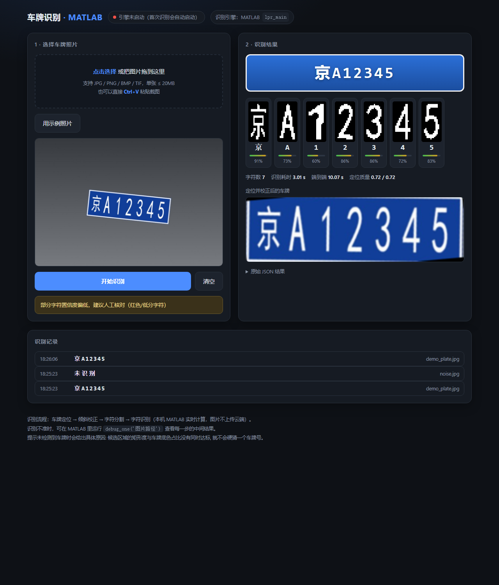

# 车牌识别网站（Python + MATLAB 后台版）

> 项目总览（三种形态、算法流程、完整实测表）见[仓库根目录 README](../README.md)。

只想「上传照片 → 看车牌号」、又不想装 MATLAB 或开服务的话，直接用 `site/index.html`：
一个 HTML 文件，双击就能跑，拷到手机上也一样，识别在浏览器里完成，不依赖这台电脑。

本目录是「Python 起网页服务 + 调本机 MATLAB 引擎」的版本，准确率最高，但 `server.py` 和
`start_lan.bat` 必须放在同一个文件夹里，只拷一个 bat 出去会报 `can't open file 'server.py'`。

浏览器上传车牌照片 → 本机 MATLAB 实时识别 → 网页显示车牌号、逐字符置信度和校正后的车牌图。
整条链路都跑在你自己电脑上，图片不上传任何云端。



不想管目录结构、只想拷一个文件的话，用 `portable/` 里的单文件版：网页、MATLAB 识别内核、
worker 全部打包成一个 `lpr_server.py`（约 253 KB），拷到任何地方双击 `start_lan.bat` 就能跑，
还带一个 `start_public.bat` 公网模式（自动开 cloudflared 隧道 + 随机访问口令，手机用 4G
也能打开）。详见 `portable/README.md`。

---

## 1. 怎么启动

**方式一（推荐）**：双击 `start.bat`
- 会自动打开浏览器到 http://127.0.0.1:8765
- 第一次打开页面时状态显示「引擎未启动（首次识别会自动启动）」，第一张图要等 10~20 秒
  （这段时间是在启动 MATLAB），之后每张 0.2~0.5 秒。
- 关闭：在那个黑窗口里按 `Ctrl+C`，或双击 `stop.bat`。

**方式二（同一局域网内的手机 / 其他电脑也能用）**：双击 `start_lan.bat`
- 服务绑定到 `0.0.0.0`，启动时会打印出局域网地址，例如：

```
 车牌识别网站已启动
   本机地址 : http://127.0.0.1:8765
   局域网   : http://192.168.1.23:8765
   ↑ 手机 / 其他电脑的浏览器里输入上面这个地址即可
   提醒     : 该服务没有账号密码, 只请在可信的家庭/办公局域网内使用
```

- 手机和这台电脑要在**同一个 WiFi / 路由器**下；第一次运行如果 Windows 弹出防火墙提示，
  勾选「专用网络」并允许，否则别的设备连不上。
- MATLAB 只在这台电脑上跑，手机只是显示页面，所以手机不需要装任何东西。
- **这个服务没有账号密码**，同网段的人都能打开并上传图片，只建议在可信网络里用；
  用完把那个黑窗口关掉即可。
- 想从外网（不在同一个 WiFi）访问，需要内网穿透/端口映射（如 frp、ngrok、WireGuard），
  并且务必先加上鉴权，否则等于把识别接口公开到公网上。

**方式三（命令行）**：

```bat
cd server
python server.py                 :: 只允许本机访问
set LPR_HOST=0.0.0.0 & python server.py     :: 允许局域网访问
```

只需要 Python 3.8+，**不需要 pip install 任何包**（全部用标准库）。
MATLAB 路径找不到时用环境变量指定：

```bat
set LPR_MATLAB=D:\MATLAB\R2024b\bin\matlab.exe
set LPR_PORT=8765
set LPR_NO_BROWSER=1
python server.py
```

## 2. 页面上有什么

- **上传**：点击选择 / 拖拽 / 直接 `Ctrl+V` 粘贴截图，支持 JPG/PNG/BMP/TIF，单张 ≤ 20MB
- **用示例照片**：一键载入 `static/demo.jpg`（京A12345），不需要自己找图
- **识别结果**：大号车牌号 + 每个字符的缩略图和置信度条（低于 60% 会提示人工核对）
- **定位质量**：`矩形度 / 车牌底色占比`，这两个值同时达标才会判定为真车牌
- **校正后的车牌**：定位 + 倾斜校正后的车牌图（MATLAB 里做了 2 倍双三次放大，不是浏览器拉伸）
- **原始 JSON**：接口返回的完整结果，方便做二次开发
- **识别记录**：最近 20 次的记录（存在内存里，重启服务就清空）

## 3. 架构：为什么用"文件队列"

```
浏览器 ──POST 原始图片字节──▶ server.py (Python 标准库 HTTP, 127.0.0.1:8765)
                                 │ 原子写入 jobs/incoming/<id>.jpg
                                 │ 轮询 jobs/results/<id>.json
                                 ▼
                      worker_lpr.m (常驻 matlab -batch, 只启动一次)
                                 │ 调 matlab 的 lpr_main 识别
                                 └▶ 结果 JSON(含 base64 图片) 写回
```

MATLAB 自身没有 HTTP 服务；MATLAB Engine for Python 对 Python 版本有严格限制
（本机 Python 3.14 就不在支持范围内）。用"文件队列 + 常驻 worker"的好处：
识别引擎只启动一次、每次调用 0.2~0.5 秒、不依赖任何第三方包、MATLAB 崩了也能自动拉起。

进程关系：`server.py` 是父进程，MATLAB worker 是子进程；服务器退出时会先让 worker 退出，不会留僵尸进程。

## 4. 文件清单

| 文件 | 作用 |
|---|---|
| `server.py` | HTTP 服务：静态页 + 4 个 API + MATLAB worker 生命周期管理 |
| `worker_lpr.m` | 常驻 MATLAB worker：轮询任务目录、调 `lpr_main`、写回 JSON |
| `static/index.html` | 单文件前端（HTML/CSS/JS 全在一个文件里，无依赖） |
| `static/demo.jpg` | 示例照片 |
| `start.bat` / `start_lan.bat` / `stop.bat` | 一键启动（仅本机）/ 一键启动（允许局域网）/ 一键停止 |
| `jobs/incoming/` | 待识别的图片（worker 处理完就删） |
| `jobs/results/` | 识别结果 JSON |
| `jobs/status.json` | worker 心跳（state/job/lastText/pid/time） |
| `jobs/worker.log` | MATLAB 侧日志，**排查问题先看这个** |
| `uploads/` | 上传原图存档 |
| `screenshot.png` | 浏览器实测截图 |
| `portable/` | **单文件版**：`lpr_server.py`（打包了网页+内核+worker）+ 两个启动脚本 + 说明 |
| `tools/build_portable.py` | 重新生成单文件版（改了网页或算法后跑一下） |
| `tools/portable_template.py` | 单文件版的模板（不要直接运行这个） |

## 5. 接口说明（想自己写前端/接别的程序时看）

| 方法 | 路径 | 说明 |
|---|---|---|
| GET | `/` | 页面 |
| GET | `/static/demo.jpg` | 示例图片 |
| GET | `/api/status` | `{worker: idle/busy/off/stopped, job, lastText, age, matlab, launches, project, port}` |
| GET | `/api/history` | 最近 20 条 `{time, file, text, ok, thumbs}` |
| POST | `/api/recognize` | body = 图片原始字节，header `X-Filename`（建议 `encodeURIComponent`），返回识别 JSON |
| POST | `/api/stop` | 只关掉 MATLAB 引擎（省内存），下次识别自动重启 |
| GET | `/api/shutdown` | 关掉整个服务（含 MATLAB worker） |

`/api/recognize` 返回示例（截取自实测）：

```json
{
  "id": "b75725c540c6", "ok": true, "text": "京A12345",
  "chars": ["京","A","1","2","3","4","5"],
  "scores": [0.910, 0.727, 0.599, 0.856, 0.863, 0.724, 0.834],
  "plateBox": [279, 291, 444, 150], "nChars": 7,
  "plateImagePng": "<base64 PNG>",
  "details": [{"char":"京","score":0.910,"png":"<base64 PNG>"}, "..."],
  "warning": "", "reason": "",
  "quality": {"score":0.611,"extent":0.725,"colorFrac":0.715,"aspect":2.628,"source":"color"},
  "file": "demo_plate.jpg", "jobId": "b75725c540c6", "total": 0.416
}
```

没检测到车牌时 `ok=true` 但 `text=""`，`warning` 里会写明原因，例如：

```
未检测到车牌: 框内车牌底色只占 0.16 (< 0.30), 没有蓝/绿/黄底色。建议换一张车牌更清晰、更居中的照片
```

## 6. 实测结果（本机 R2024b / Python 3.14 / Edge）

| 项目 | 结果 |
|---|---|
| 服务启动 + MATLAB 预热 | 15 秒左右（`launches=1`，只拉起一个 MATLAB） |
| 单张识别（引擎预热后，MATLAB 侧） | 0.22~0.35 s |
| 单张识别（HTTP 往返，含传输） | 0.4~0.5 s |
| 浏览器官网端到端（点"用示例照片"→出结果） | 0.42 s（截图那次 4.66 s，含 MATLAB 首次 JIT） |
| 示例图识别 | 京A12345 ✔，逐字符置信度 91/73/60/86/86/72/83% |
| 纯噪声图 | 未检测到车牌 ✔（提示底色占比 0.16 < 0.30） |
| 页面 JS 报错 | 0 |

浏览器端到端是怎么验证的：用无头 Edge + CDP 驱动真实页面，
点击「用示例照片」→「开始识别」，读取 DOM 里的车牌号、字符卡片、指标并截图，
同时校验 `window.__errs` 为空。脚本放在 `tools/` 里，见下一节。

## 7. 自带的两个自测脚本

用 Node.js（18+）跑，不需要 npm install，产物写到 `tools/out/`：

```bat
node tools/test_api.mjs        :: 接口级: 首页/静态资源/状态/识别/历史, 并把返回的图片存下来
node tools/test_browser.mjs    :: 浏览器级: 真的去点按钮、读页面、截图
```

`test_browser.mjs` 需要先开一个带调试端口的浏览器（Chrome/Edge 都行）：

```bat
msedge.exe --headless=new --remote-debugging-port=9222 ^
           --user-data-dir=%TEMP%\lpr_test --window-size=1280,1500 about:blank
```

`test_browser.mjs` 会输出这样的结果（实测）：

```
[3] 点"开始识别"  : 已完成渲染
    识别结果文字   : 京A12345 | class = plate
    逐字符卡片     : 京/91%  A/73%  1/60%  2/86%  3/86%  4/72%  5/83% | 缩略图数 7
    指标           : 字符数 7 | MATLAB 0.25 s | 总耗时 0.42 s
[4] 负例(纯噪声图): 未检测到车牌 | 提示可见: block
[5] 页面 JS 错误    : []
```

## 8. 常见问题

| 现象 | 原因 / 处理 |
|---|---|
| 页面一直显示「无法连接后端」 | `server.py` 没在跑，或端口被占（改 `LPR_PORT`） |
| 首次识别等很久 | 正常，是在启动 MATLAB（10~20 秒）；看页面上的"正在启动 MATLAB 识别引擎"提示 |
| 一直提示「正在启动」不结束 | 看 `jobs/worker.log`；多半是 `LPR_MATLAB` 路径不对，或 MATLAB license 被占用 |
| 提示未检测到车牌 | 换一张车牌更大、更正、光线更好的照片；写真车牌时用手机横拍整辆车 |
| 识别结果不对 | 模板匹配的固有精度（bench 字符 99.3%、整牌 95.0%），见 `../matlab/README.md` 第 8 节 |
| 换电脑/发给别人时提示找不到 `server.py` | `.py` 和 `.bat` 必须在同一个文件夹里。最省事的办法是用 `portable/` 的单文件版，只需拷一个文件；微信里传 `.py` 有时会被拦，建议压成 zip 再发 |
| 想让手机/其他电脑访问 | 双击 `start_lan.bat`（等价于 `set LPR_HOST=0.0.0.0`），再用它打印的局域网地址打开；记得放行防火墙「专用网络」 |
| 内存吃紧 | 不识别时 `POST /api/stop` 释放 MATLAB 进程，下次识别会自动重启 |

## 9. 开发中踩过的坑（改代码前建议先看）

1. **worker 预热期间绝对不能重复拉起**。MATLAB 启动要 10~20 秒，这段时间 `jobs/status.json`
   还是旧的（状态被判定为 `off`），如果一看到 `off` 就再拉一个，请求等待循环会每 0.1 秒开一个 MATLAB，
   实测开出 92 个进程，直接把内存和页面文件吃光，MATLAB 报
   `UnsatisfiedLinkError: ...nio.dll: 页面文件太小` 然后 abort，看起来像"MATLAB 崩了"。
   现在有两条硬约束：`STARTUP_GRACE=90`（进程还活着就耐心等，绝不重复拉起）+
   `LAUNCH_COOLDOWN=15`（两次拉起最小间隔），并且 `recognize()` 不再用 `force=True`。
2. **前端提示框必须清掉内联 `display`**。`showMsg` 原来只改 `className`，
   而之前 `pick()` 设过的 `style.display='none'` 是内联样式，优先级高于 `.err/.warn` 类，
   结果"未检测到车牌""部分字符置信度偏低"这些提示永远不显示（DOM 里有文字、页面看不见）。
   现在 `showMsg` 里显式 `m.style.display = t ? '' : 'none'`。
3. **心跳不能用 MATLAB 写入的时间戳比较**。MATLAB 的 `datetime('now','TimeZone','local')` 与
   Python 的 `time.time()` 在时区/时钟上可能不一致，会出现"心跳永远是 5 小时前"导致反复重启。
   现在统一用 `jobs/status.json` 的文件 mtime 计算心跳年龄。
4. **关机时要先立"正在关机"标志，再停服务**。收到 `/api/shutdown` 后，如果还有请求线程卡在
   "等 MATLAB 出结果"的循环里，它会看到引擎状态是 `off` 于是又拉起一个新的 MATLAB，
   而这个新进程已经没人管了 —— 结果是服务关了、MATLAB 却一直留在后台轮询。
   所以加了 `_shutting_down` 标志（`begin_shutdown()` 里置位），关机期间任何线程都不再拉起新引擎。
   实测：修之前出现过关服务后残留在 2 个 MATLAB 进程；修之后关机干净，`MATLAB worker 0 个`。
5. **任务文件要原子写入**。`server.py` 先写 `<id>.jpg.part` 再 `os.replace`，
   worker 写结果也是先 `.json.tmp` 再 `movefile`，避免读到写了一半的文件。

## 10. 想继续扩展

- 批量上传 / 文件夹批量识别，结果导出 CSV
- 识别结果写数据库，做停车场进出记录
- 视频流：前端抽帧上传，或后端直接读 `VideoReader` + 多帧投票
- 换成 CNN 字符识别（`matlab/train_char_cnn.m`），把难集与实拍上的整牌准确率往上提

算法本体（定位/校正/分割/识别、调参、限制）见上级目录 `../matlab/README.md`。
